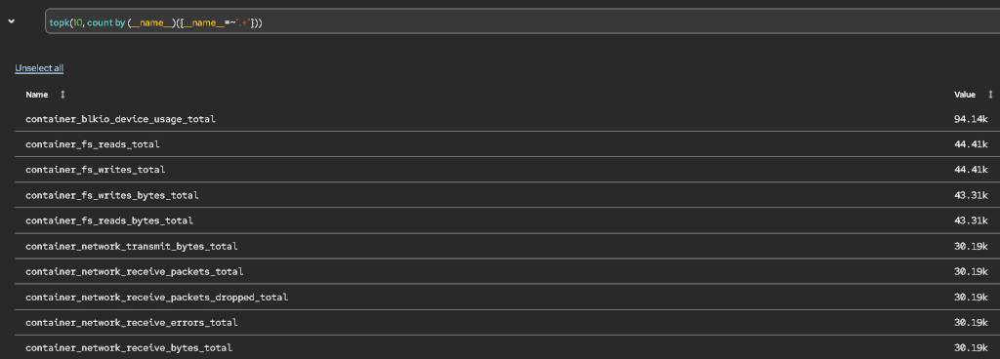

# Platform Prometheus on OCP 4.20 (hosted): disk vs memory

Operational note. Context: hosted cluster (HCP), platform Prometheus (`prometheus-k8s`) in `openshift-monitoring`, cluster under heavy VM load (CNV).

## Symptom

WAL write fails, `/prometheus` is full:

```
msg="Scrape commit failed" ... err="write to WAL: ... no space left on device"
```

## The key point: these are two distinct problems

- **Disk**: TSDB/WAL fills the PVC. Fixed with a bigger PVC plus `retentionSize`.
- **Memory**: Prometheus RAM is driven by the active series count (head series), not by retention. `retentionSize` and lowering retention do not touch this.

Do not conflate them. The disk fix below does not reduce memory usage.

## Disk fix (done)

Order matters: expand the PVC first (manual, online expansion if the StorageClass has `allowVolumeExpansion: true`), then update the `volumeClaimTemplate`. The CMO does not shrink a PVC, and the StatefulSet template is immutable, so the ConfigMap is what keeps the desired state aligned.

`retentionSize`:

- Correct key, sibling of `retention` under `prometheusK8s`. Key order in the map does not matter.
- Value is base-10: `GB`, not `GiB`. The Red Hat docs list the suffixes B, KB, MB, GB, TB, PB, EB.
- Leave headroom. Compaction runs every 2h and can temporarily double a block. Target around 75% of the PVC.

```yaml
apiVersion: v1
kind: ConfigMap
metadata:
  name: cluster-monitoring-config
  namespace: openshift-monitoring
data:
  config.yaml: |
    prometheusK8s:
      retention: 15d
      retentionSize: 120GB          # ~75% of 150Gi, headroom for compaction
      resources:                    # MEMORY lever (see section below)
        requests:
          memory: <adjust>
        limits:
          memory: <adjust>
      volumeClaimTemplate:
        spec:
          storageClassName: <sc>
          resources:
            requests:
              storage: 150Gi
```

While disk usage stays above `retentionSize`, `KubePersistentVolumeFillingUp` keeps firing. Expected behavior.

## Cardinality (the cause of the "overloaded" state)

The top series are 100% cAdvisor (kubelet `/metrics/cadvisor` endpoint). The worst is `container_blkio_device_usage_total`: per-container times per-device times per-operation (Read/Write/Sync/Async/Discard). It scales with the number of VMs and block devices, so on a large CNV cluster it explodes. The `container_fs_*` and `container_network_*` metrics follow the same per-container logic.



### Cutting cAdvisor on 4.20: no supported path

- `collectionProfile: minimal`: GA only in OCP 4.22. On 4.20 it requires the `TechPreviewNoUpgrade` feature set (on a hosted cluster, via `HostedCluster.spec.configuration`), which is a one-way door and blocks minor upgrades. Do not use in production.
- `metricRelabelings` on the `kubelet` ServiceMonitor: owned by the CMO, manual edits are reverted.
- `metricRelabelings` only work on your own ServiceMonitors (loki-gateway etc.), which are not the driver here.

### Memory lever on 4.20

Only supported option: give more RAM via `prometheusK8s.resources` (request/limit). This treats the symptom. The actual cAdvisor cardinality cut waits for the 4.22 upgrade (collection profiles GA).

## Quick diagnosis

```bash
# disk
oc -n openshift-monitoring exec prometheus-k8s-0 -c prometheus -- df -h /prometheus

# cardinality (run against the platform Prometheus)
# PromQL: topk(10, count by (__name__)({__name__=~".+"}))

# memory / OOM
oc -n openshift-monitoring get pods -l app.kubernetes.io/name=prometheus
oc -n openshift-monitoring describe pod prometheus-k8s-0 | grep -i oomkilled
```

## Summary

- **Disk**: bigger PVC plus `retentionSize` (in `GB`, ~75%, PVC before the template). Done.
- **Memory**: only `prometheusK8s.resources`. `retentionSize` does not help.
- **cAdvisor cardinality**: no supported cut on 4.20. Waits for 4.22.
- **Managed cluster**: if `cluster-monitoring-config` is under a ConfigurationPolicy (ACM), the change goes through the policy, do not edit directly on the cluster.
